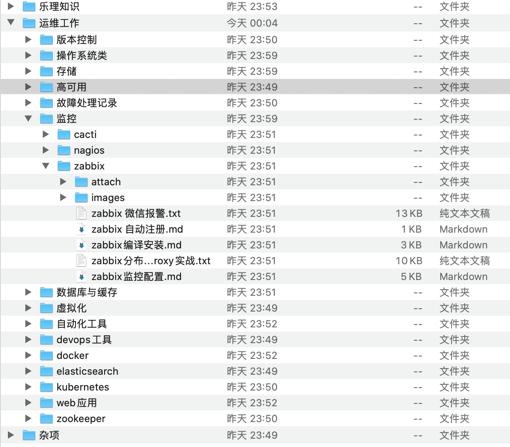

# Leanote Export to Markdown
```
由于本人使用leanote 想转换回wiz
发现leanote 没有导成markdown的方法。。
只好自己手动操作了。。
无限目录树结构、链接替换、附件下载
```

### 编译
```shell script
go build -mod=vendor main.go
```


### 使用方法：
```
Leanote 网址[default: https://leanote.com]： 
UserName: ggangelo
password: 
ggangelo xxxxxx
登陆成功 ggangelo(29xxxxx@qq.com)!
保存到[default(.)]:  /Users/charles/Downloads/ouput
bye bye! ggangelo
```

#### 导出效果图：


## 附带一个导入wiz笔记的python脚本
环境： python 3.7 以上
库： requests, requests_toolbelt
```
pip install requests requests_toolbelt
```
具体使用方法请查看
```python
if __name__ == '__main__': 
```